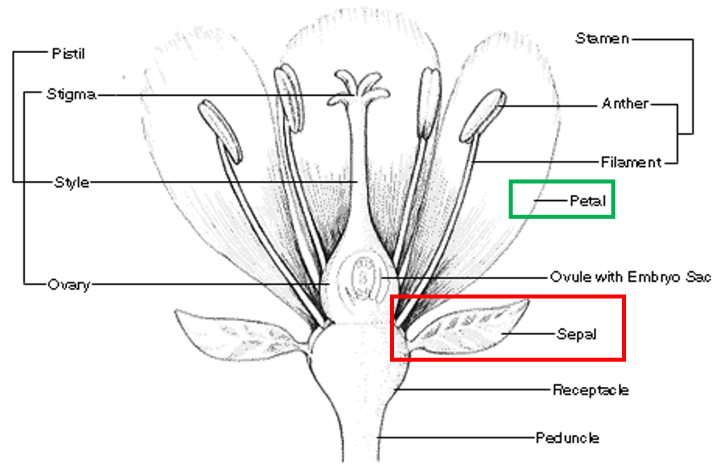

```{r klippy, echo=FALSE, include=TRUE, warning=F}
klippy::klippy()
```

***
# Downloading R and RStudio
***

There are two files that you must download to have RStudio work on your computer.  

First visit the <a href="https://cran.rstudio.com/" target="_blank">CRAN website</a>.  Select "Download R for Windows."

Second, visit  <a href="https://www.rstudio.com/products/rstudio/download/" target="_blank">the RStudio</a> website.  Select the "Download" under RStudio Desktop FREE.  This will automatically scroll you to the bottom of the page.  You can then select "RStudio 1.2.1335 - Windows 7+ (64-bit)" under installers.   

Finally, to familiarize yourself with RStudio watch the following video:  <a href="https://www.youtube.com/watch?v=5YmcEYTSN7k">Intro to R Video</a>.

***
#Getting Started
***

***
##Installing Tidyverse
***

R uses packages that provide additional capabilities.  Because R is an opensource community people around the world are constantly developing packages that make your life easier.  To install tidyverse you will need to run the following line of code in the Console.  (You only have to do this one time).  This may take a while depending on your internet connection.

```{r eval=FALSE}
install.packages("tidyverse")
```

***
## Setting the Working Directory
***

One of the first things to do as a new R user is to set the working directory. This will make sure R always knows where to start looking for any data files you wish to reference.  Create a folder on your desktop or someplace convenient to save all the data you work with using R.

Each time you create a new script you will need to set the working directory to read in data files.  To do this we will use the `setwd()` command.  Inside of the command you will paste the address of the folder your data is located in.  This address can be found by right clicking the folder and selecting properties.  The folder location is under the General tab.  Here is an example of setting a working directory.  NOTE:  you will have to change you "\\" to "/".  You can easily accomplish this by Ctrl+F which opens a find and replace like Microsoft products.
```{r eval=FALSE, include=TRUE}
setwd("C:/Users/Bryan.Adams/Desktop/MA206Y/Intro_to_Tidy")
```

***
##Lines of code you will have in every script
***

We will be using tidyverse nearly every lesson in this course.  Each time you open RStudio you will need to tell RStudio you want to use tidyverse.  This is done using the `library()` command.  Every time you create a new script in this course the first two lines you code will be...  

```{r warning=FALSE,message=FALSE}
library(tidyverse)
setwd("C:/Users/Bryan.Adams/Desktop/MA206Y")
```

Each time you reopen RStudio you will need to rerun the above two lines of code.  NOTE: you will have to change your working directory to the relevant file location (Where you saved the data set you are working on).

***
## Reading in a data file
***

Throughout the course you will be provided several data sets.  To get your data into RStudio we will use the `read_csv()` command.  Note, this command will not work unless you have properly set your working directory.

This tutorial will use the popular Iris data set.  Information about the data set is found at its very own Wikipedia <a href="https://en.wikipedia.org/wiki/Iris_flower_data_set">Page</a>!  In short, the Iris data set is a data set containing 150 observations of iris flowers that recorded 5 variables - sepal length, sepal width, petal length, petal width, and species.

You may download the data set from you instructor's <a href="https://usma.blackboard.com/" target="_blank">Blackboard Page</a>.  It is found in the Data Sets folder title "IrisData.csv".  Save the file in your working directory.

### Summary of the Iris Data Set

The following table is a summary of the data in the data set.  When provided a data set by researchers they will often provide you a guide similar to this that describes the data to you.

<center>
|Variable |Column Name |Units |Variable Type|
|--------|-----------|-----|-------------|
|Sepal Length|Sepal.Length|cm| Quantitative|
|Sepal Width|Sepal.Width|cm| Quantitative|
|Petal Length|Petal.Length|cm| Quantitative|
|Petal Width|Petal.Width|cm| Quantitative|
|Species |Species |`NA`| Categorical|
</center>

```{r pressure, echo=FALSE, fig.cap="Figure 1: Iris Flower", out.width = '100%'}

```

The following code will read in the data set and name it `iris.data`.

```{r}
iris.data=read_csv("IrisData.csv")
```

You will now notice you have a variable in your Global Environment named "iris.data". 

Next you can look at your data using the `head()` command.  This will show the first six rows of your data.

```{r}
head(iris.data)
```

You will notice that each column has a name.  Each column represents a variable and could be quantitative or categorical.  When you want to reference a specific variable, we will use the name of the column.  Example:

```{r}
iris.data$Sepal.Length
```

This is just one of the several ways to reference a specific variable in a data set.


***
#Using Tidyverse to Explore the Data
***

Step 3 of the Six Steps of a Statistical Investigation is to "Explore the Data."  Tidyverse is designed to assist with data exploration.

The commands we will use are `summarise()`, `filter()`, `select()`, `mutate()`, and `group_by()`.

First, we need to learn the "pipe" which is the term used to describe `%>%`.  When reading the code, you can replace `%>%` with "and then."  This command makes reading and interpreting your code easier.  This will become clearer as we work through examples.

The following selections will cover a few of the Tidyverse commands:
<center>
|Command| Purpose|
|-------|-----------------------------------------------|
|`summarise()`|Allows you to make calculations using your data|
|`filter()`|Return rows with matching conditions|
|`select()`|Select variables by name|
|`mutate()`|Add new variables|
|`group_by()`|Group by one or more variables|
</center>
## The Summarise Command

Perhaps you would like to know the variability - see page 7 of your textbook - of the sepal length (Sepals are the green leaves that are found at the bottom of a flower).  The summarise command will do this in conjunction with the command `var()`.  The `var()` command calculates the variance of data.

```{r}
iris.data%>%
  summarise(Sepal.Length.Variance = var(Sepal.Length))
```

The output that appears in your console contains the calculation.  In this example the variance of the sepal lengths is  0.686 $cm^2$

This is how you would read the above code.  Take my iris.data "and then" summarise the data, specifically calculate the variance of the Sepal.Length.

You can also find the mean (or average) - see page 8 of your textbook - of the sepal length using the `mean()` command.

```{r}
iris.data%>%
  summarise(Sepal.Length.mean = mean(Sepal.Length))
```

You can also find the standard deviation - see page 8 of your textbook - of the sepal length using the `sd()` command.

```{r}
iris.data%>%
  summarise(Sepal.Length.sd = sd(Sepal.Length))
```

## The Filter Command

Perhaps you are only interested in a specific species of Iris.  In this data set there are three species:  setosa, versicolor, virginica.  If you wanted the mean sepal width of just the setosa species, you can use the filter command.  The filter command works just like the filter command in Excel.  It works with equalities and inequalities: `==`,`<=`,`>=`,`<`,`>` and not equal to `!=`.

```{r}

iris.data%>%
  filter(Species=="setosa")%>%
  summarise(Sepal.Width.mean=mean(Sepal.Width))
```

If you were to read this code, you would say:  Take iris.data "and then" filter to keep only the "setosa" species "and then" calculate the mean of the sepal width.  The resulting mean of the Setosa Iris sepal widths is 3.43 $cm$.

When using the filter command to filter based on a string (words) you will have to put the words inside of `""`.  

You can also retain only the rows of data with a sepal width less than or equal to 3.

```{r}
iris.data%>%
  filter(Sepal.Width<=3)
```

Notice when using the filter command to filter based on a numerical value you do not have to put the number inside of `""`.

You can also make a new data set for just the setosa species

```{r}
setosa.data=iris.data%>%
  filter(Species=="setosa")
```

You will notice you have a new variable in your global environment called setosa.data.

## The Select Command

In real world problems you will have more variables (columns) than you want in your data set.  Big data sets are difficult for your computers to handle and sometimes will make manipulation difficult.  Let's say that you want your data set to only have sepal length and Species. You can use the select command to do this.  The select command retains or removes columns from a data set.

```{r}
iris.data%>%
  select(Sepal.Length,Species)
```

You can also use `-` to remove columns.

```{r}
iris.data%>%
  select(-Sepal.Width,-Petal.Length,-Petal.Width)
```

Both methods give you the same results, but sometimes it's easier to remove columns you want removed or select columns you want to keep.

## The Mutate Command
Sometimes you might want to calculate a new variable using your existing variables.  What if you wanted a new variable:  The ratio of the petal length to the petal width.  The mutate command allows you to create new variables (columns) using mathematical manipulations.

```{r}
iris.data%>%
  mutate(Petal.Ratio=Petal.Length/Petal.Width)
```

You will notice that there is now a new column (variable) named Petal.Ratio.

You can now find the mean of the Petal Ratio:
```{r}
iris.data%>%
  mutate(Petal.Ratio=Petal.Length/Petal.Width)%>%
  summarise(Petal.Ratio.mean=mean(Petal.Ratio))
```

## The group_by Command

The `group_by()` command is powerful command that lets you do manipulations to several subsets of your data set.  You have seen how to calculate the mean of the petal length, but what if you wanted to calculate the mean of the petal length by species type.  The `group_by()` command allows you to do this.

```{r}
iris.data%>%
  group_by(Species)%>%
  summarise(Petal.Length.Mean=mean(Petal.Length))
```

The output is a table that contains the means of each species petal length.  You can now see that the mean petal length of the virginica is much larger than the setosa (by over 4 cm).  What conclusions can you draw from these calculations?  Could you say the virginica species is bigger than the setosa species?  We will learn more about what conclusions (inferences) you can draw from your data throughout this course.

You are also able to make multiple calculations at one time.  Now you will calculate the mean and standard deviation of the petal length by species.  Each calculation is separated by a `,` inside of the summarise command.

```{r}
iris.data%>%
  group_by(Species)%>%
  summarise(Petal.Length.Mean=mean(Petal.Length),Petal.Length.SD=sd(Petal.Length))
```

You now have an output that contains the means and standard deviation of each species petal lengths.  For example, the mean petal length of the Virginica Iris is 5.55 $cm$ and the standard deviation of the petal length of the Virginica Iris is 0.552 $cm$.

## Creating Variables in R to use for Future Calculations

In later chapters you will need to calculate a sample mean and sample standard deviation to use in other formulas.  The easiest way to accomplish this is to create variables.  You will make a variable called mean.petal.length.  

```{r}
mean.petal.length = iris.data%>%
  summarise(Petal.Length.mean=mean(Petal.Length))

```

When you name a variable, you will not have output in your console.  To see the output, you must type the variable name.

```{r}
mean.petal.length
```

You now have a new variable called mean.petal.length in your global environment.  Its value is 3.758 $cm$.  If you wanted to use this variable in a different equation you just need to type the variable name, just like in Mathematica:

```{r}
2*mean.petal.length
```

## Summary of Tidyverse

In this section you learned some of the commands in the tidyverse library.  There are other commands inside of tidyverse. You can read about them in the online book <a href="https://r4ds.had.co.nz/">R for Data Science</a>.

<center>
|Command| Purpose|
|-------|-----------------------------------------------|
|`summarise()`|Allows you to make calculations using your data|
|`filter()`|Return rows with matching conditions|
|`select()`|Select variables by name|
|`mutate()`|Add new variables|
|`group_by()`|Group by one or more variables|
</center>

***
#Using ggplot2 to Explore the Data
***

Inside of the tidyverse library is another library named ggplot2.  The Preliminaries section of *Introduction to Statistical Investigations* discusses using figures to explore the data.  In this class we will use ggplot2 to help visually explore our data.

## ggplot2 Structure

Using ggplot2 to create a figure is a lot like making a cake.  You add extra layers to a cake and we will add extra layers to our figure.  First, we need to understand the structure of the code.

The first command is `ggplot()`.  I do not think that surprises anyone.  Inside of `ggplot()` we will use `aes()` which stands for aesthetics.  Here is an example using the Iris data set.  For my figure I want to compare petal Length to petal width to see if there is a linear relationship.  I want petal length on my x-axis and petal width on my y-axis.  We will use the `%>%` (pipe) to send our data to the `ggplot()` command.

```{r,fig.show='hide'}
iris.data%>%
  ggplot(aes(x = Petal.Length,y=Petal.Width))
```

Inside of `aes()` you tell ggplot what you want where.  `x = ` assigns your x-axis to a variable and `y = ` assigns your y-axis to a variable.  

Next, we will add a geometric object.  This is the type of figure you want to make.  There are many options, but you must choose the one that works best for the story you are going to tell.  We will add this "layer" using `+`.  I believe a scatter plot is the best option for our figure (recall from MA103 that you made scatter plots on your final course project).  Each geometric object command begins with `geom_` and is followed by the type.  A list of geometric objects will be provided at the end of the section.  For a scatter plot it is `point()`.  Here is the code to make the plot:

```{r}
iris.data%>%
  ggplot(aes(x = Petal.Length,y=Petal.Width))+geom_point()
```

We are not done yet.  This plot lacks a title and proper axis labels.  To correct this, we will add another layer.  There are several options, but we will use the `labs()` command and add this "layer" using a `+`.

```{r}
iris.data%>%
  ggplot(aes(x = Petal.Length,y=Petal.Width))+geom_point()+
  labs(x="Petal Length (cm)",y="Petal Width (cm)",title = "Petal Length (cm) vs Petal Width (cm)")
```

Inside of the `labs()` command it is easy to interpret each portion.

When you look at this plot you notice there are two distinct groups, but why?  This might be because of the species.  Remember the Virginica Species had a mean petal length 4 $cm$ larger than the Setosa Species.  Next, we will color the points based on their species.  We will add `color = Species` inside of `aes()`.

```{r}
iris.data%>%
  ggplot(aes(x = Petal.Length,y=Petal.Width, color = Species))+geom_point()+
  labs(x="Petal Length (cm)",y="Petal Width (cm)",title = "Petal Length (cm) vs Petal Width (cm)")
```

Now you can see that each species has a distinct grouping.  

## More ggplot2 Commands

So far you have seen some of the ggplot2 capabilities; however, there are many more options to make the figure you want.  You can read about them in the online book <a href="https://r4ds.had.co.nz/">R for Data Science</a>.

Here are just a few more commands you will find useful.  Each layer is added using a `+`.

### How to change a legend title

You can add this in your `labs()` layer.

```{r}
iris.data%>%
  ggplot(aes(x = Petal.Length,y=Petal.Width, col = Species))+geom_point()+
  labs(x="Petal Length (cm)",y="Petal Width (cm)",title = "Petal Length (cm) vs Petal Width (cm)", color = "Species of Iris")
```

You now see the legend title has changed to "Species of Iris"

### How to change font size

You can change your font size, and many other attributes, in the `theme()` layer.  

```{r}
iris.data%>%
  ggplot(aes(x = Petal.Length,y=Petal.Width, color = Species))+geom_point()+
  labs(x="Petal Length (cm)",y="Petal Width (cm)",title = "Petal Length (cm) vs Petal Width (cm)", color = "Species of Iris")+
  theme(text = element_text(size=20))
```

Or you can have your title be a larger font size too by adding `plot.title = element_text()` inside of the `theme()` layer.

```{r}
iris.data%>%
  ggplot(aes(x = Petal.Length,y=Petal.Width, color = Species))+geom_point()+
  labs(x="Petal Length (cm)",y="Petal Width (cm)",title = "Petal Length (cm) vs Petal Width (cm)", color = "Species of Iris")+
  theme(text = element_text(size=20),plot.title=element_text(size=30))
```

### Change axis values

You can also change the numbers and their range along your axis.  To do this we will add the layers `scale_x_continuous()` and `scale_y_continuous()`

To change the range, you set `limits=c(a,b)` where `a` is your lower limit and `b` is your upper limit.

To change the breaks, you set `breaks=c(1,2,3)` where now only the numbers 1, 2 and 3 will appear on your axis.

```{r}
iris.data%>%
  ggplot(aes(x = Petal.Length,y=Petal.Width, color = Species))+geom_point()+
  labs(x="Petal Length (cm)",y="Petal Width (cm)",title = "Petal Length (cm) vs Petal Width (cm)", color = "Species of Iris")+
  scale_x_continuous(limits=c(0,7),breaks=c(0:7))+
  scale_y_continuous(limits=c(0,3),breaks=c(seq(from = 0,to = 3,by = .5)))
```

In this example we used `breaks=c(0:7)` to make our "breaks" along our x-axis but we could have typed `breaks=c(0,1,2,3,4,5,6,7)`.  When you use the `:` R automatically creates a sequence of numbers.

Also, we used `breaks=c(seq(from = 0,to = 3,by = .5))` to make our breaks along our y-axis.  The `seq()` command makes a sequence of numbers using the step size you set (`by = 0.5`)

### Change the size of your points

You can also change your size of your points based on a different variable.  In this example we will size our dots based on the sepal length.  Before we used `aes()` inside of the `ggplot()` command, but we can also use it inside of our geometric object to add other features to our graphic, like `size = `.

```{r}
iris.data%>%
  ggplot(aes(x = Petal.Length,y=Petal.Width, color = Species, size = Sepal.Length))+geom_point()+
  labs(x="Petal Length (cm)",y="Petal Width (cm)",title = "Petal Length (cm) vs Petal Width (cm)", color = "Species of Iris")
```

We are not happy with the new legend title, but we can change in our `labs()` layer by adding `size = "Sepal Length (cm)"`.

```{r}
iris.data%>%
  ggplot(aes(x = Petal.Length,y=Petal.Width, col = Species))+geom_point(aes(size = Sepal.Length))+
  labs(x="Petal Length (cm)",y="Petal Width (cm)",title = "Petal Length (cm) vs Petal Width (cm)", color = "Species of Iris", size = "Sepal Length (cm)")
```

## Other ggplot2 Geometric Objects

In the prior examples we only made scatter plots, but we can make several other figurers; here are just a few.

<center>
|Command| Type of Graph/Figure|
|-------|--------------------|
|`geom_histogram()`|Creates a histogram|
|`geom_box()`|Creates a box plot|
|`geom_dotplot()`|Creates a dot plot|
|`geom_bar()`|Creates a bar chart|
|`geom_jitter()`|Creates a scatter plot, but is useful for big data|
|`geom_line()`|Creates a line|
</center>
***
##Recreating Graphics from the Preliminaries Chapter
***

We will now use ggplot2 to recreate the figures found in the preliminaries chapter.  We will not go into detail for each command or layer.

We will first remake Figure P.3 found on page 7 of your textbook.  The data set is titled "prelim.OldFaithful1.csv" and is found on your instructor's Blackboard page under the Data Sets folder.

```{r,warning=FALSE,message=FALSE}
OldFaithful.Data = read_csv("prelim.OldFaithful1.csv")

OldFaithful.Data%>%
  ggplot(aes(x = Time))+geom_dotplot(binwidth = 1)+
  scale_y_continuous(NULL, breaks = NULL)+
  scale_x_continuous(limits=c(40,100),breaks = c(seq(40,100,5)))+
  labs(x="Time until next eruption (min)", y = "Frequency",
       title = "Time between eruptions of Old Faithful geyser")
```

Another option that will be introduced later in the textbook is a histogram.  With ggplot2 you only must change one command.
```{r message=F, warning=F}
OldFaithful.Data = read_csv("prelim.OldFaithful1.csv")

OldFaithful.Data%>%
  ggplot(aes(x = Time))+geom_histogram()+
  labs(x="Time until next eruption (min)", y = "Count",
       title = "Time between eruptions of Old Faithful geyser")
```

This is a more common figure than a dot plot.  With this figure you are still able to determine/identify the shape, center, variability and any unusual observations (see page 9 of your textbook).

Next, we will remake the Figure P.1 found on page 3 of your textbook.  The data set is titled "prelim.OrganDonor.csv" and is found on the course webpage under the Data Sets folder.

```{r}
OrganDonor.Data = read_csv("prelim.OrganDonor.csv")

OrganDonor.Data%>%
  ggplot(aes(x=Default,fill=Choice))+geom_bar(position = "fill")+
  labs(x = "Default",y="Percentage",title="Percentages for organ donation study")
```

Since the dataset contains "neutral" and not "Neutral".  We can change this using tidyverse before we make the plot.  You will also use the `ifelse()` command which is very close to what you used in python for "if - else" statements.

```{r}
OrganDonor.Data%>%
  mutate(Default = ifelse(Default=="opt-in","Opt-in",Default))%>%
  mutate(Default = ifelse(Default=="opt-out","Opt-out",Default))%>%
  mutate(Default = ifelse(Default=="neutral","Neutral",Default))%>%
  mutate(Choice=ifelse(Choice=="donor","Donor",Choice))%>%
  mutate(Choice=ifelse(Choice=="not","Not",Choice))%>%
  ggplot(aes(x=Default,fill=Choice))+geom_bar(position = "fill")+
  labs(x = "Default",y="Percentage",title="Percentages for organ donation study")
```

Here is a description of the following code chunk:

```{r,eval=FALSE}
mutate(Default = ifelse(Default=="opt-in","Opt-in",Default))
```

For every row in your data set the command looks at the Default variable value.  If the current value is "opt-in" then change it to "Opt-in" else leave it alone.

The figures are looking similar now, but maybe you really want Donor to be on the bottom.  You can specify the order of the stacking.  Inside of `ggplot(aes(x=Default,fill=Choice))` we will change `fill=Choice` to `fill=factor(Choice, levels=c("Not","Donor"))`.  

```{r}
OrganDonor.Data%>%
  mutate(Default = ifelse(Default=="opt-in","Opt-in",Default))%>%
  mutate(Default = ifelse(Default=="opt-out","Opt-out",Default))%>%
  mutate(Default = ifelse(Default=="neutral","Neutral",Default))%>%
  mutate(Choice=ifelse(Choice=="donor","Donor",Choice))%>%
  mutate(Choice=ifelse(Choice=="not","Not",Choice))%>%
  ggplot(aes(x=Default,fill=factor(Choice, levels=c("Not","Donor"))))+geom_bar(position = "fill")+
  labs(x = "Default",y="Percentage",title="Percentages for organ donation study", fill = "")
```

***
##Summary of ggplot2
***
In this section you learned some of the ggplot2 commands necessary to create figures to visually explore your data.  There are other commands inside of ggplot2. You can read about them in the online book <a href="https://r4ds.had.co.nz/">R for Data Science</a>.

***
#How the Course Director troubleshoots code
***
It is frustrating when your code does not run.  The first thing I do is copy the error message into Google and see what I can find on the internet.  99% of the time the first link solves the issue.

It is frustrating not knowing the command to use.  When I want to do something different that I do not know how to do I Google how do you do __________ with tidyverse or ggplot2.
