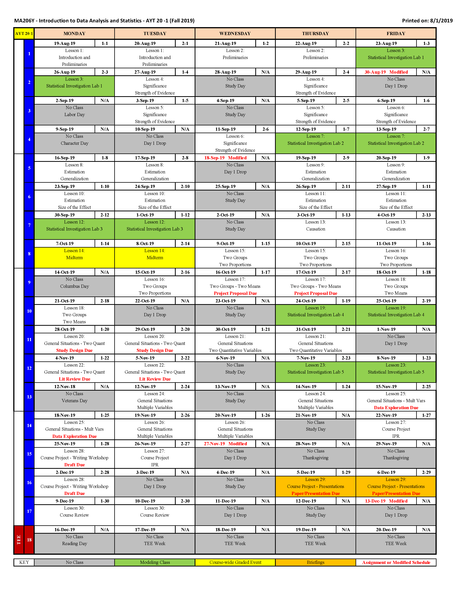

```{r klippy, echo=FALSE, include=TRUE, warning=F}
klippy::klippy()
```

```{r knitr_init, echo=FALSE, cache=FALSE, warning=F}
library(knitr)
library(rmdformats)

## Global options
options(max.print="75")
opts_chunk$set(echo=TRUE,
	             cache=TRUE,
               prompt=FALSE,
               tidy=TRUE,
               comment=NA,
               message=FALSE,
               warning=FALSE)
opts_knit$set(width=75)

set.seed(1)
```

***

<center></center>

*** 

Visit your instructor's <a href="https://usma.blackboard.com/" target="_blank"> Blackboard page </a>  to find more resources for the course.

***
# Welcome

***
## Why Study Data Analysis and Statistics

How does sleep affect my performance on the athletic field? Does drinking coffee improve my WPR grades?  How accurately can we predict the score of the Army/Navy football game?  Every day, we encounter questions, like these, for which data provides important insights.  Scientists, corporations, governments, political parties, professional sports teams, and militaries ask similar questions.  In an age where almost everything is connected to the internet, we can inform more and more of their questions with data.

In this course, you will gain valuable experience using data in the investigative process to answer research questions. Our course project gives you the opportunity to investigate a research question of interest to you (start thinking about your project idea now!), and you will collaborate with your instructor throughout the investigative process.    The investigative process is a framework for approaching a statistical analysis.  The six steps are: ask a research question, design a study and collect data, explore the data, draw inferences beyond the data, formulate conclusions, and look back and forward.  If this sounds intimidating now, don't worry -- it's an iterative process, and your instructors will provide hands-on feedback throughout the process.

Conceptually, this course builds on your previous education by fostering an understanding of the central role of variability and randomness.  After getting an interesting statistical result ("coffee helps my grades!!"), it's a natural question: how likely am I to get a similar result if I repeated this process again? If it's not likely, then your result isn't that interesting.  This course will help you answer this question more formally.  Computer simulations, acting as "alternate realities", are important tools in this process.  

You will become much more efficient at visualizing and summarizing data through hands-on exercises in our statistical investigation labs.  To do this, you will have to learn a programming language called R, available free online and used by millions around the world.  Will it seem hard at first? Probably.  Will it make you more efficient? Yes.  Will you be successful? Definitely.  In the end, you will be much more prepared to collect and analyze data of interest to you.

We hope you enjoy this course and look forward to your projects! 


***
## Course Objectives

By the end of this course you will be able to

1.	Use the investigative process in statistics to answer research questions of interest and be able to communicate results to general audiences.

2.	Produce and interpret graphical displays and numerical summaries of data.

3.	Recognize and explain the central role of variability and randomness in designing studies and drawing conclusions.

4.	Employ appropriate single and multivariate statistical models and interpret and draw conclusions from standard output of statistical software packages. 

5.	Understand and use basic ideas of statistical inference (hypothesis tests and confidence intervals) in a variety of settings.

6.	Be critical consumers of statistically-based results and recognize whether reported results reasonably follow from the study and analysis conducted.

***
## Course Organization

The course point breakdown is:
<center>
Event|Points|
-----|:----:|
Instructor Points|100|
Statistical Investigation Labs (5)|175 (35 points each)|
Midterm| 175|
TEE|250|
Course Project|300|
</center>

The course is organized in several blocks that follow the chapters in *Introduction to Statistical Investigations*.  Each block has multiple lesson objectives that you are responsible for.  All the lesson objectives are covered in the assigned readings and your instructor will review some of the lesson objectives during class time.

Throughout the course you will have Statistical Investigation Labs.  These labs are designed to introduce you to R and conducting a statistical investigation.  You will have the 75-min class period to work on the lab, but they will not be due until the start of the next lesson.  It is important to note that these are individual/group assignments and you may lose points if you over rely on assistance from someone outside of your group.

The Midterm and TEE are comprehensive exams and cover all material up to the exam.  Each question on an exam is directly linked to a lesson objective and will be asked in a similar manner to the questions in the textbook.

The course project will give you the opportunity to conduct a statistical investigation into something of interest.  This is a group project (2 cadets per group).  You will have several graded milestones throughout the semester.  The group project will be discussed more in depth during Lesson 4.

***

## How to Prepare for a Lesson

The first place you should look at the start of a lesson is the course guide.  Each block has **Lesson Objectives**.  These are what we expect you to learn from the reading.  Your preparation before class and your engagement in discussion and exercises that take place during the class period all contribute to your ability to understand the **Lesson Objectives**.  

Each lesson has an assigned reading.  When you read the textbook, you should have the **Lesson Objectives** in mind.  This will allow you to focus your reading.  Additionally, throughout the textbook are example and exploration problems.  You are highly encouraged to work through the example and exploration problems.  The exploration problems are an excellent way to test your understanding of the **Lesson Objectives**. The course director will post selected solutions to the exploration problems after each lesson.  

Finally, use the R code provided in the course guide to replicate the examples in the textbook.  Each data file for the textbook examples are found on your instructor's blackboard page under textbook data sets.  You will be expected to use the same code on exams.  The more comfortable you are with the technology, the more capable you will be at conducting a statistical investigation.  It is important to seek assistance early if you are having difficulty with R.

***
## Course Calendar

<center></center>

***
## Course Textbook

The textbook makes use of applets throughout the book.  The biggest key to success in this course is to work through the example problems presented in the textbook.  The applets for the textbook can be found <a href="http://www.rossmanchance.com/ISIapplets.html" target="_blank"> here </a>.  If you work through each example using the applets and the accompanying R code found in the course guide, you will do **extremely well** in the course.

There are also data sets used throughout the textbook.  The data sets for the example problems in the textbook can be found on your instructor's <a href="https://usma.blackboard.com/" target="_blank"> Blackboard page </a> or <a href="http://www.isi-stats.com/isi/data.html" target="_blank"> here </a>.

There are also several other resources for the textbook on <a href="https://www.wileyplus.com/user-login/" target="_blank"> WileyPLUS </a>.  For example, on page 59 of your textbook you will see **FAQ 1.4.1**.  The answer to this question can be found in your digital textbook available on <a href="https://www.wileyplus.com/user-login/" target="_blank"> WileyPLUS </a>. 

***
# Preliminaries - Introduction to Statistical Investigations

***

##  (Lesson 1 - 3) Introduction to Statistical Analysis 

Lesson objectives:

1. Understand the six steps of a statistical investigation.
2. Understand the four pillars of statistical inference.
3. Understand basic terminology: observation units, quantitative and categorical variables, and distributions.
4. Use R to summarize and visualize important aspects (shape, center, variability, and unusual observations) of quantitative variables.
5. Understand how simulation helps us make decisions involving random processes.

<center>
  <font size = 6>
    **Six Steps of a Statistical Investigation**
  </font>
</center?

<center>{width=400px}</center>

|**Lesson Topics Covered:**
|------
|Introduction
|Six Step Investigative Process
|Aspects of distributions
|Using R and Tidyverse


**Homework:**                              

|**Lesson** |**Reading**|**Homework Problems**|
|-------------|-------|-----------------------|
|Lesson 1|Section P.1 |P1.2, P1.4, P1.10      |       
|Lesson 2|Section P.2 and P.3|P1.8, P2.2, P2.8, P2.9       |       
|Lesson 3|<a href = "https://lms.westpoint.edu/math/ma206y/Shared%20Documents/Introduction_to_RStudio_and_Tidyverse.html">Tidyverse Tutorial</a>                 ||  

***
# Significance:  How Strong is the Evidence?

***

##  (Lesson 4 - 7) Strength of Evidence 

Lesson objectives:

1. Understand how statistical significance indicate the strength of evidence.
2. Apply the 3S Strategy for measuring strength of evidence.
3. Understand the difference between parameters and statistics.
4. Develop a null and alternative hypothesis for a research question.
5. Use R to simulate data from random processes in chance models.
6. Assess the strength of evidence using a p-value and standardized test statistic.
7. Determine the strength of evidence using the theory-based approach (also known as one-proportion $z$-test)
8. Understand what factors impact the strength of evidence.


|**Lesson Topics Covered:**
|----------------------------------------------------------------------------
|3S Strategy for Measuring Strength of Evidence
|Chance models
|Test of significance
|Hypothesis testing
|Simulation methods for determining p-values and standardized test statistic
|Theory-Based Approaches for determining p-values and standardized test statistic


**Homework:**                              

|**Lesson** |**Reading**        |**Homework Problems**|
|--------|---------------|--------------------------------|
|Lesson 4|Section 1.1 and 1.2   |1.1.6, 1.1.12, <br> Sarah the Chimpanzee (1.2.12), <br>Love first (1.2.16)| 
|Lesson 5|Section 1.3 and 1.4   |Zwerg (1.1.15-1.1.18),<br> Right or left (1.3.13), <br> Zwerg (1.3.18), Harley (1.4.16, 1.4.17), <br> Healthy Lungs (1.4.26)     |       
|Lesson 6|Section 1.5           |Presidential stature (1.4.28-1.4.29), 1.5.8, <br> Psychic abilities (1.5.13 - 1.5.14)                     |
|Lesson 7||Lady tasting tea (1.1.13 - 1.1.14), <br> Tasting tea (1.3.17), 1.4.26|

### R Code for Lesson 4 - 7

In chapter 1, the textbook discusses simulating chance models as part of the 3S strategy.  The textbook uses a applets found on the internet <a href="http://www.rossmanchance.com/ISIapplets.html">here</a> to generate various **Null Distributions**, but you will be expected to use R to create a null distribution and determine a p-value like the applet.  This section of the course guide will provide you the knowledge and code to conduct these simulations.

#### How to simulate your null distribution

##### Example 1.2 (p. 35 - 41)

Here is the code to conduct the same simulation found on page 39 of your textbook to generate your **Null Distribution**. All simulations in chapter 1 can be conducted with this code.  The only values you will have to change are `Sample.Size`, `Null.Prob` and `Sample.Stat`.  

```{r}
library(tidyverse)

Replications=NULL

Num.Reps = 1000
Sample.Size = 12
Null.Prob = 1/3
Sample.Stat = .167

for(i in 1:Num.Reps){
  
  Trials = sample(x = c(1,0),size = Sample.Size,prob = c(Null.Prob,1-Null.Prob),replace = TRUE)
  
  Proportion = sum(Trials)/Sample.Size
  Replications = rbind(Replications,data.frame(Proportion))

}

Replications%>%
  ggplot(aes(x=Proportion))+
  geom_histogram()+
  labs(x="Proportion of Success",y="Count")+
  geom_vline(xintercept = Sample.Stat,color="red")

```

Here is the code to add a second vertical line if you are doing a two-sided hypothesis test.  This example is if your test statistic is to the left of the null hypothesis value.  We simply add `geom_vline(xintercept = Null.Prob+(Null.Prob-Sample.Stat),color="red")`.  This code will change if it is to the right of the null hypothesis value.

```{r}
Replications%>%
  ggplot(aes(x=Proportion))+
  geom_histogram()+
  labs(x="Proportion of Success",y="Count")+
  geom_vline(xintercept = Sample.Stat,color="red")+
  geom_vline(xintercept = Null.Prob+(Null.Prob-Sample.Stat),color="red")

```

Here is the explanation of the above code with the steps you will use to conduct a simulation of a chance model.

1. `Replications = NULL` - Creates an empty data frame to store your replications of your experiment.
2. `Num.Reps=1000` - Your number of replications of your experiment 
3. `Sample.Size = 12` - Number of observations in one experiment
4. `Null.Prob=1/3` - Your null hypothesis value, most cases it will be `1/2`.
5. `Sample.Stat = 0.167` - Your sample statistic.  
6. Conduct the simulation - The `for` loop works much like `for` loops in python.  The command reads like this: "For 1 to number of repetitions do the following commands."  
7. `sample()` - replicates your experiment.  There are several settings inside of the `sample()` command.  
    + `x=c(1,0)` is what the computer will select from.  Think of it as you are reaching into a bag with two ping-pong balls.  One ball has a `1` and the other has a `0`.  Generally, a `1` is a "success" and a `0` is a failure.  In the context of this problem a `1` is "plays scissors" and a `0` is "doesn't play scissors." (see page 37, Table 1.3).
    + `size=Sample.Size` - This means the command will just select a `1` or `0` twelve (12) times.  This is because there twelve(12) observations in your experiment.
    + `prob = c(Null.Prob,1-Null.Prob)` - This weighs how likely the computer will select a `1` or a `0`.  In this case you have a $\frac{1}{3}$ chance of selecting a `1` and a $\frac{2}{3}$ chance of selecting a `0`.  This allows you to **replicate your experiment assuming your null hypothesis is true**.
    + `replace=TRUE` - replaces the number back into the "bag" each time you draw.  This allows you to simulate all twelve(12) observations in your experiment.
    
8. `Proportion = sum(Trials)/Sample.Size` - finds the proportion of success from one simulated experiment where the null hypothesis is assumed to be true.  This is why a "success" is a `1` because it makes it easier to total the number of "success," which the `sum()` command does.  You then divide the total by the number of observations to calculate a proportion.  
9. `Replications = rbind(Replications,data.frame(Proportion))` - stores each iteration.  When you start your `for` loop `Replications` is empty.  You replicate your first experiment and save it to `Replications`.  The `data.frame()` command puts the generated experimental outcome into a format that allows the `rbind()` command to add it to the current `Replications` data frame.
10. `ggplot()` - follows the same structure discussed in the Lesson 3 <a href = "https://lms.westpoint.edu/math/ma206y/Shared%20Documents/Introduction_to_RStudio_and_Tidyverse.html">reading</a>.

#### How to calculate the p-value from your Null Distribution

```{r}
Replications%>%
  summarize(p.value=sum(Proportion<=Sample.Stat)/n())
```

1. To calculate the p-value you use the `summarize()` command.  Inside of the command you will see `sum(Proportion <= Sample.Stat)`.  This counts the number of occurrence that have a proportion "less than" your observed proportion from your experiment.  Next the value is divided by `n()`, which is the total number of replications you used.  In this case it is 1000.

You will notice this value is different from the p-value in the textbook.  This is because it is a simulation.  Each time you run the code you will have a different p-value.

<!-- Here is how you would calculate the p-value for a two-sided hypothesis test: -->

<!-- ```{r} -->
<!-- Replications%>% -->
<!--   summarize(p.value=(sum(Proportion<=Sample.Stat)+sum(Proportion>=(Null.Prob + (Null.Prob - Sample.Stat))))/n()) -->
<!-- ``` -->

#### Theory-Based Approach - How to conduct a one-proportion z-test

##### Example 1.5 (p. 64 - 67)

This portion of code follows the calculations for example 1.5 on pages 64 - 67.  It uses the "chap1.Halloween.csv" data set, which can be found in the Course Guide Data Sets folder on your instructor's Blackboard page.  Do not forget to set your working directory to the file location.  

```{r}
library(tidyverse)

Halloween = read_csv("chap1.Halloween.csv")
```
###### Checking the validity conditions

The validity conditions required for a one-proportion z-test is to have at least 10 "success" and 10 "failures."  We will use the `count()` command to count the number of times a kid chose "Candy" (success) or "Toy" (failure).

```{r}
Halloween%>%
  count(Selection)
```

##### One-proportion z-test

On page 66 your textbook walks through the steps to calculate the p-value using a theory-based approach on the applet.  In our course **you will be expected to use R to calculate the p-values on exams**.  The command for a **one-proportion z-test** is `prop.test()`.  Here is how we use it to calculate the p-value for the "Halloween Treats" problem.

```{r}
prop.test(x=148,n=283,p=0.5,alternative = "two.sided",correct = F)
```

In the output you will notice that the `p-value = 0.4397`.  This differs slightly from the p-value found in Figure 1.20 on page 66 of your textbook (0.4390).  This is because the `prop.test()` command operates off different assumptions that will not be discussed in this course, but this command is the most commonly used command for a one-proportion test.  R will also not round until the end of the calculations.

Here is a breakdown of the commands in the `prop.test()`:

1. `x=148` is the number of "successes" in your data set.
2. `n=283` is the number of observations in your data set.
3. `p=0.5` is your null hypothesis.
4. `alternative = "two.sided"` is your alternative hypothesis.
5. `correct = F` will be left as such for this course.

The other options for the alternative hypothesis are:

<center>
|Alternative Hypothesis|R Code|
|:--------------------:|------|
|$>$|`alternative = "greater"`|
|$<$|`alternative = "less"`|
|$\neq$|`alternative = "two.sided"`|
</center>

***
# Generalization:  How Broadly Do the Results Apply?
***

##  (Lesson 8 - 9) Generalization

Lesson objectives:

1. Understand the importance of generalizing results in a statistical analysis.
2. Understand the difference between samples and populations.
3. Understand the difference between a convenience sample and when estimating parameters and generalizing results.
4. Using technology, calculate unbiased estimators for estimating population means and proportions from simple random samples.
5. Describe the shape, center and variability of observed data and the impact unusual observations (outliers) have on the mean and median of the data.
6. Use the simulation approach to evaluate claims about a single population mean.
7. Understand the validity conditions necessary to conduct a one-sample t-test for a single population mean and use R to conduct a one-sample t-test for a single population mean
8. Understand the differences between Type I and Type II error.

<center>{width=400px}</center>


|**Lesson Topics Covered:**
|----------------------------------------------------------------------------
|Sampling methods and its impact on conclusions
|Inference on a single population mean
|Significance level
|Type I and II error


**Homework:**                              

|**Lesson** |**Reading**        |**Homework Problems**|
|--------|---------------|--------------------------------|
|Lesson 8|Section 2.1 |Class Survey (2.1.10 - 2.1.15),<br>Television News Survey (2.1.26 - 2.1.31)|
|Lesson 9|Section 2.2 and 2.3|How much TV do you watch? (2.2.11 - 2.2.13),<br>Needles (2.2.19 - 2.2.20),<br>How cool are you? (2.2.22)|

### R Code for Lesson 8 - 9

<!-- #### How to simulate your null distribution -->

<!-- To simulate the **Null Distribution** for a quantitative variable we will use a method different from the one discussed in Lesson 4 - 7.  According to the central limit theorem on p. 127 of your textbook we now the sample mean equals the population mean and the standard deviation of the sample means equals $\frac{s}{\sqrt{n}}$.  Additionally, we know the sample means is normal.  To conduct the simulation in this block we will use the `rnorm()` command which generates a null distribution for a normal population. -->

<!-- This example is Example 2.2 on p.121 of your textbook.  The data set (Example_2_2.csv) is found on the course website.  Remember to set your working directory to the proper folder. -->

<!-- ```{r} -->
<!-- library(tidyverse) -->

<!-- Elapsed.Time = read_csv("Example_2_2.csv") -->

<!-- Replications = NULL -->
<!-- Num.Reps = 1000 -->
<!-- Sample.Size = 48 -->
<!-- Sample.SD = Elapsed.Time%>% -->
<!--   summarize(sd(Time))%>% -->
<!--   as.numeric() -->
<!-- Null.Mean = 10 -->
<!-- Sample.Stat = 13.71 -->

<!-- Means = rnorm(n = Num.Reps,mean = Null.Mean, sd = Sample.SD/sqrt(Sample.Size)) -->

<!-- Replications = rbind(Replications,data.frame(Means)) -->

<!-- Replications%>% -->
<!--   ggplot(aes(x=Means))+geom_histogram(fill="cadetblue",color="black")+ -->
<!--   labs(x="Proportion of Success",y="Count")+ -->
<!--   geom_vline(xintercept = Sample.Stat,color="red") -->
<!-- ``` -->

<!-- There a few differences between this simulation in the one previously discussed.  The biggest difference you probably noticed is that we no longer need a `for` loop.  This is thanks to the **Central Limit Theorem**.  Here is an explanation of the steps of this simulation. -->

<!-- 1. Create an empty data frame to store your replications of your experiment`Replications = NULL` does that for you. -->
<!-- 2. Create variables that represent your number of repetitions (`Num.Reps=1000`), number of observations (`Sample.Size = 12`), calculate your sample standard deviation (`Sample.SD = Elapsed.Time%>%summarize(sd(Time))%>%as.numeric()`), your null hypothesis (`Null.Mean=10`), and your sample statistic (`Sample.Stat = 13.71`).  You may call them whatever you like.  The only additional step is calculating your sample standard deviation. -->
<!-- 3. `rnorm()` generates your sample means according to the **Central Limit Theorem**. -->
<!-- 4. The next line of code: `Replications = rbind(Replications,data.frame(Means))` stores your simulation into useable data frame. -->
<!-- 5. The `ggplot()` command follows the same structure discussed in the Lesson 3 <a href = "https://lms.westpoint.edu/math/ma206y/Shared%20Documents/Introduction_to_RStudio_and_Tidyverse.html">reading</a>. -->

<!-- #### How to calculate the p-value from your Null Distribution -->

<!-- ```{r} -->
<!-- Replications%>% -->
<!--   summarize(p.value=sum(Means >= Sample.Stat)/n()) -->
<!-- ``` -->

<!-- 1. To calculate the p-value you use the `summarize()` command.  Inside of the command you will see `sum(Means >= Sample.Stat)`.  This counts the number of occurrence that have a mean "greater than" your observed mean from your experiment.  Next the value is divided by `n()`, which is the total number of replications you used.  In this case it is 1000. -->

<!-- You will notice this value might be different from the p-value in the textbook.  This is because it is a simulation.  Each time you run the code you will have a different p-value. -->

#### Theory-Based Approach - How to conduct a one-sample t-test

##### Eample 2.2 (p. 121 - 130)

This portion of code follows the calculations for example 2.2 on pages 121 - 130.  It uses the "chap2.ElapsedTime.csv" data set, which can be found in the Course Guide Data Sets folder on your instructor's Blackboard page.  Do not forget to set your working directory to the file location.

```{r}
library(tidyverse)

Elapsed.Time = read_csv("chap2.ElapsedTime.csv")
```

###### Checking the validity conditions

Recall that we can create a histogram to visualize the distribution of the data.  On page 128 the validity conditions required for a *one-sample t-test* are discussed.  Here is the code to create a histogram of the data to check the validity conditions, e.g. is the distribution **strongly skewed**.

```{r}
Elapsed.Time%>%
  ggplot(aes(x = Time))+geom_histogram()+
  labs(x = "Time (seconds)", y = "Count", 
       title = "Estimated time of snippet in seconds")
```

###### One-sample t-test


On pages 127 - 128 your textbook walks through the steps to calculate the p-value using a theory-based approach on the applet.  In our course **you will be expected to use R to calculate the p-values on exams.**  The command for a **one-sample t-test** is `t.test()`.  Here is how you calculate the p-value for the "Elapsed Time" problem.

```{r}
  t.test(x = Elapsed.Time$Time, alternative = "two.sided",mu = 10)
```

In the output you will see your **standardized statistic** `t = 3.9525` and your **p-value** `p-value = 0.0001293`.  You can compare these results to the results in Figure 2.10 on page 128 of your textbook.  

The commands to execute a `t.test()` are similar  `prop.test()`. Here is a breakdown of the commands in the `t.test()`

1. `x = Elapsed.Time$Time` tells it you are looking at just the times in the experiment.  The `$` says take my data frame and look at just one column.
2. `alternative = "two.sided"` is because your alternative hypothesis is not equal to $(\neq)$.
3. `mu = 10` is the value of your null hypothesis.

The other options for the alternative hypothesis are:

<center>
|Alternative Hypothesis|R Code|
|:--------------------:|------|
|$>$|`alternative = "greater"`|
|$<$|`alternative = "less"`|
|$\neq$|`alternative = "two.sided"`|
</center>
***
# Estimation: How Large is the Effect?
***

## (Lesson 10 - 12) Estimation

Lesson objectives:

1. Understand estimation and the logic of confidence intervals, a set of plausible values for the size of an effect.
2. Use R to calculate confidence intervals for single proportions and means using theory-based approaches
3. Understand factors affecting the width of confidence intervals.
4. Be aware of several cautions related to inference


|**Lesson Topics Covered:**
|----------------------------------------------------------------------------
|Simulation and theory-based approaches for determining confidence intervals for a single proportion
|Simulation and theory-based approaches for determining confidence intervals for a single mean
|Factors that affect a confidence interval
|Nonrandom and random errors
**Homework:**                              

|**Lesson** |**Reading**        |**Homework Problems**|
|---------|---------------|--------------------------------|
|Lesson 10|Section 3.1 and 3.2|3.1.4, July 2012 Gallup poll (3.1.22 - 3.1.23), 3.2.10, Coke or Pepsi (3.2.18), FAQ (3.2.30)|
|Lesson 11|Section 3.3 - 3.5|How much TV do you watch? (3.3.4 - 3.3.5), 3.3.21, School Survey (3.4.15 - 3.4.20)|
|Lesson 12|Review Lesson 10 - 11||

### R Code for Lesson 10 - 12
 
<!-- In the previous lessons we showed you how to simulate a **Null Distribution** for a single proportion (Lesson 4 - 7).  To conduct the simulation approach, we will use the same method to generate the **Null Distribution**. For your convenience we have the same code used before to generate the **Null Distribution** for a single proportion with the additional code needed to determine the simulated (2SD) and theory-based confidence interval. -->

<!-- #### How to use simulation to determine the confidence interval for a single proportion -->

<!-- ##### 2SD Method -->
<!-- Here is the code to conduct the same simulation found on page 175 of your textbook to generate your **Null Distribution**. This is the example presented in section 3.2, The Affordable Care Act.  You will notice that the `Null.Prob` is 0.5.  Your textbook discusses the reason for this on page 175.    -->

<!-- ```{r} -->
<!-- library(tidyverse) -->

<!-- Replications=NULL -->

<!-- Num.Reps = 1000 -->
<!-- Sample.Size = 1034 -->
<!-- Null.Prob = 0.5 -->

<!-- for(i in 1:Num.Reps){ -->

<!--   Trials = sample(x = c(1,0),size = Sample.Size,prob = c(Null.Prob,1-Null.Prob),replace = TRUE) -->

<!--   Proportion = sum(Trials)/Sample.Size -->
<!--   Replications = rbind(Replications,data.frame(Proportion)) -->

<!-- } -->

<!-- Replications%>% -->
<!--   ggplot(aes(x=Proportion))+geom_histogram(fill="cadetblue",color="black")+ -->
<!--   labs(x="Proportion of Success",y="Count") -->

<!-- ``` -->

<!-- Next, we need to find the standard deviation of the **Null Distribution**.  We will use the same commands found in the Tidyverse tutorial. -->

<!-- ```{r} -->
<!-- SD = Replications%>% -->
<!--   summarise(SD = sd(Proportion)) -->

<!-- SD -->

<!-- ``` -->

<!-- In this example the standard deviation is `0.0151.`  Last, we will use the formula found on page 175.  It is important to note the sample statistic is `0.69` or 69%.  This is found on page 173 of your textbook. -->

<!-- ```{r} -->
<!-- 0.69-2*SD -->
<!-- 0.69+2*SD -->

<!-- ``` -->

<!-- This gives you the confidence interval of (0.660, 0.720). -->

<!-- ##### Method 2 -->

<!-- There is another way to arrive at a confidence interval using simulation-based approaches.  What would happen if we simulated the **Null Distribution** under the assumption the observed statistic is true and found which values in our **Null Distribution** gave us 2.5% of the area to the left and right.  Reference the picture on page 174.  This time the `Null.Prob` will be 0.69 (the experiments observed statistic) -->

<!-- ```{r} -->
<!-- Replications=NULL -->

<!-- Num.Reps = 1000 -->
<!-- Sample.Size = 1034 -->
<!-- Null.Prob = 0.69 -->

<!-- for(i in 1:Num.Reps){ -->

<!--   Trials = sample(x = c(1,0),size = Sample.Size,prob = c(Null.Prob,1-Null.Prob),replace = TRUE) -->

<!--   Proportion = sum(Trials)/Sample.Size -->
<!--   Replications = rbind(Replications,data.frame(Proportion)) -->

<!-- } -->

<!-- Replications%>% -->
<!--   ggplot(aes(x=Proportion))+ -->
<!--   geom_histogram(fill="cadetblue",color="black")+ -->
<!--   labs(x="Proportion of Success",y="Count") -->

<!-- ``` -->

<!-- Next, we will find the values that give us the center 95% of the outcomes that make our histogram which gives us the lower and upper bound of our 95% confidence interval. -->

<!-- ```{r} -->
<!-- quantile(Replications$Proportion,probs = c(0.025,0.975)) -->

<!-- ``` -->
<!-- You will notice these values are very close to the values found on page 174 for the confidence interval and to the one used in the previous method. -->

<!-- Here is a plot of the simulated distribution with lines at the lower and upper bounds of the confidence interval. -->

<!-- ```{r} -->
<!-- Replications%>% -->
<!--   ggplot(aes(x=Proportion))+ -->
<!--   geom_histogram(fill="cadetblue",color="black")+ -->
<!--   labs(x="Proportion of Success",y="Count")+ -->
<!--   geom_vline(xintercept = 0.662,color="red")+ -->
<!--   geom_vline(xintercept = 0.719,color="red") -->

<!-- ``` -->

#### Theory-Based approach - How to calculate a confidence interval for one-proportion

##### Example 3.2 (p. 173 - 177)

This portion of code follows the calculations for example 3.2 on pages 173 - 177.  There is no data set for this problem, but the sample statistics are found on page 173.  The sample size ($n = 1034$) and the sample statistic is  ($\hat{p} = 0.69$), which implies that the number of success is 714.  In this example a success is they have not felt any impact from the Affordable Care Act.

You could manually calculate the confidence interval (see page 176: $\hat{p} \pm \text{multiplier}* \sqrt{\hat{p}*(1-\hat{p})/n}$).  R has the ability to do this for using `prop.test()` command.  

```{r}
prop.test(x = 714, n = 1034, alternative = "two.sided", conf.level = 0.95, correct = F)

```

In the output you will see your 95% confidence interval of (0.662,0.718).  This is found in the output after "95 percent confidence interval:".  You can compare this result to the result in Figure 3.7 on page 176 of your textbook.

<!-- #### How to use simulation to determine the confidence interval for a single Mean -->

<!-- 2SD method formula to find a confidence interval is found on page 182 of the textbook.  The following code provides an alternative simulation technique to determine the confidence interval.  This is known as bootstrapping.  We will use the data set for Example 3.3, "chap3.UsedCars.csv".  This technique will be discussed in class.  As always, ensure you set your working directory. -->

<!-- ```{r} -->
<!-- library(tidyverse) -->

<!-- Used.Cars = read_csv("chap3.UsedCars.csv") -->

<!-- Replications = NULL -->
<!-- Num.Reps = 1000 -->
<!-- Sample.Size = 102 -->

<!-- for(i in 1:Num.Reps){ -->

<!--   Sample = sample(x = Used.Cars$Price,size = Sample.Size,replace = TRUE) -->

<!--   Mean = mean(Sample) -->
<!--   Replications = rbind(Replications,data.frame(Mean)) -->

<!-- } -->

<!-- Replications%>% -->
<!--   ggplot(aes(x=Mean))+geom_histogram(binwidth = 500,fill="cadetblue",color="black")+ -->
<!--   scale_x_continuous(breaks=c(seq(10000,15000,500)))+ -->
<!--   labs(x="Mean Used Car Price ($)",y="Count") -->

<!-- ``` -->

<!-- Next, we will find our 95% confidence interval. -->

<!-- ```{r} -->
<!-- quantile(Replications$Mean,probs = c(0.025,0.975)) -->
<!-- ``` -->

<!-- This gives us a confidence interval of (\$12,386.28, \$14,109.72).  You will notice this is close to the values on page 182 (\$12,394, \$v14,190.10). -->

#### Theory-Based approach - How to calculate a confidence interval for single mean

##### Example 3.3 (p. 181 - 184)

This portion of code follows the calculations for example 3.3 on pages 181 - 184.  It uses the "chap3.UsedCars.csv" data set, which can be found in the Course Guide Data Sets folder on your instructor's Blackboard page.  Do not forget to set your working directory to the file location.

```{r}
library(tidyverse)

Used.Cars = read_csv("chap3.UsedCars.csv")
```

You could manually calculate the confidence interval (see page 184: $\overline{x} \pm \text{multiplier} * s/\sqrt{n}$).  R has the ability to do this using the `t.test()` command.

```{r}
t.test(x = Used.Cars$Price,alternative = "two.sided",conf.level = .95)
```

The theory-based 95% confidence interval is (\$12,401.66, \$14,183.01).  You can compare this result to the result in Figure 3.10 on page 183 of your textbook.

***
# Causation 
***

## (Lesson 13) Causation

Lesson objectives:

1. Be able to explain when and why you can conclude association or cause-and-effect relationship between an explanatory and response variable.
2. Given an observational study, identify explanatory, response, and confounding variables.
3. Understand the difference between observational studies and experiments.
4. Understand why randomizing experimental units removes the effect of confounding variables.

<center></center>

|**Lesson Topics Covered:**
|----------------------------------------------------------------------------
|Explanatory, response, and confounding variables
|Observational versus experimental study
|Drawing association versus cause-and-effect conclusions

**Homework:**                              

|**Lesson** |**Reading**        |**Homework Problems**|
|---------|---------------|--------------------------------|
|Lesson 13|Chapter 4|4.1.2, 4.1.3, 4.1.4,<br>4.1.9, 4.1.25,  4.2.6,<br>4.2.14, 4.2.21, 4.2.22|

***
# Midterm WPR (Lesson 14)
***


Time: 75 minutes 

**Midterm Instructions**

**READ THESE INSTRUCTIONS CAREFULLY BEFORE STARTING WORK.**

1. Administration

* This exam is designed to assess your individual understanding of the course objectives.  
* You may **not** use the internet, email, or music devices.
* You are authorized the following:
* Your computer with access to a blank Excel worksheet, a blank Mathematica notebook, a blank RStudio script, course guide and tidyverse tutorial; 
* Use **data=read_csv("file.csv")** to read any **.csv** files into RStudio;
* Your personal copy of the textbook;
* Any calculator;
* All work written on this exam will be graded unless it is clearly marked through.
* A test OIC and/or your instructor is located in the hallway for questions.

2. You Should:
* Place all items in the hallway that are not needed for the test.
* Show all mathematical work needed to justify your answers and round all numbers to at least three significant digits. If you are using technology, make sure you transfer sufficient information onto your exam in order to logically present your thought process.
* Prepare RStudio for TEE use by clicking the broom button in the "History," "Environment," and "Plots" panes to delete all stored commands, variables, and plots respectively. Use the shortcut key "CTRL+L" to clear any commands from your "Console."  You may have only one script open, and it must be blank. 
* If you need more space to complete a problem, use a separate sheet for each problem continued.  Clearly indicate which problem is continued with "Continued on sheet **#**" on the problem page and "Problem **#** continued'' on the extra sheet.  Also, clearly write your name and section on any extra sheets.

***
# Comparing Two Groups
***

## (Lesson 15 - 16) Comparing Two Proportions

Lesson objectives:

1. Apply the six steps of the statistical investigation method to compare two groups on a binary response.
2. Create two-way tables, segmented bar graphs and calculate relative risk to explore the data from two groups with a categorical response variable.
3. Develop a null and alternative hypothesis for a research question for comparing two proportions.
4. Apply the 3S Strategy assess whether two sample proportions differ enough to conclude that there is a genuine difference in the population proportions/process probabilities.
5. Use the 2SD method to estimate a confidence interval for the difference in two proportions.
6. Determine the strength of evidence using the theory-based approach (two-sample z-test) for comparing two proportions.

|**Lesson Topics Covered: **
|----------------------------------------------------------------------------
|Methods used to explore the data when comparing two proportions (two-way table and segmented bar graph)
|Simulation methods for determining p-values for comparing two proportions
|Theory-based approaches for determining p-values for comparing two proportions
|Theory-based approaches for determining confidence intervals for the difference in two proportions
|Validity conditions for the difference in two proportions

**Homework:**                              

|**Lesson** |**Reading**        |**Homework Problems**|
|---------|---------------|--------------------------------|
|Lesson 15|Section 5.1 and 5.2|5.1.2, 5.1.6, <br> US Senators (5.1.8 - 5.1.11), 5.2.2, <br> Surgery or not (5.2.4), Sexual discrimination (5.2.27 - 5.2.28)|
|Lesson 16|Section 5.3|5.2.7, 5.2.17, <br> Surgery and prostate cancer (5.3.13), 5.3.20, <br> The physicians' Health Study (ulcers) (5.3.27-5.3.30)|
***

### How to create a two-way table from data.

#### Example 5.1 (p. 261 - 263)

This portion of code follows the creation of the two-way table for example 5.1 on pages 261 - 263.  It uses the "chap5.GoodandBad.csv" data set, which can be found in the Course Guide Data Sets folder on your instructor's Blackboard page.  Do not forget to set your working directory.

Before you have seen the `count()` command used to count single items in a data set, but it can be used to count multiple items.  Here we will use the count command to count the outcomes by two categorical variables.  The two-way table is a quick way to ensure the validity conditions are met for the theory-based approach of comparing two proportions (two-proportion z-test).

```{r}
library(tidyverse)

Good.Bad = read_csv("chap5.GoodandBad.csv")

Good.Bad%>%
  count(Wording,Perception)
```

You will notice this does not look like Table 5.2 found on page 262.  With a few more commands, that you are not expected to know, can help you recreate the table.  To learn more about the `spread()` command click <a href="https://r4ds.had.co.nz/tidy-data.html" target="_blank">HERE</a>

```{r}
Good.Bad%>%
  count(Wording,Perception)%>%
  spread(Wording,n,fill=0)%>%
  mutate(Total = badyear + goodyear)
```

### Theory-Based Approach - How to conduct a two-proportion z-test

#### Example 5.3 (p. 284 - 290)

This portion of code follows the calculations for example 5.3 on pages 284 - 290.  It uses the summary of data found on page 284.  

The command for a two-proportion $z$-test is `prop.test()`. Additionally the command will calculate the confidence intervals for the difference in the proportions.  

When conducting a two-proportion $z$-test it is important to identify $\pi_1$ and $\pi_2$.  In this example $\pi_1$ is the proportion of all smoking parents in the population who have boys and $\pi_2$ is the proportion of all nonsmoking parents in the population who have boys.  This is important because it impacts which order you enter your information into the `prop.test()` command.

```{r}

prop.test(x = c(1975,255), n = c(3602,565),
          alternative = "two.sided",conf.level = 0.95,
          correct = F)
```

In the output you will notice that the p-value is $1.73*10^{-5}$ and the 95\% confidence interval for the difference in proportions is (0.053, 0.141).  You can compare the results to the results in Figure 5.12 on page 287 (p-value) and Figure 5.13 on page 288 (95% confidence interval)

## (Lesson 17 - 19) Comparing Two Means

Lesson objectives:

1. Apply the six steps of the statistical investigation method to comparing two groups on a quantitative response.
2. Calculate the five-number summary (quartiles) and create histograms and boxplots to explore the data from two groups with a quantitative response variable.
3. Develop a null and alternative hypothesis for a research question for comparing two means.
4. Assess the statistical significance of the observed difference between two groups.
5. Apply the 3S Strategy to assess whether two sample means differ enough to conclude that there is a genuine difference in the population means or long-run means of a process.
6. Use the 2SD method to estimate a confidence interval for the difference in two means.
7. Determine the strength of evidence using the theory-based approach (two-sample t-test) for comparing two means.


|**Lesson Topics Covered:**
|----------------------------------------------------------------------------
|Methods used to explore the data when comparing two quantitative responses (five-number summaries and side by side boxplots)
|Simulation methods for determining p-values for comparing two quantitative responses
|Theory-based approaches for determining p-values for comparing two quantitative responses
|Theory-based approaches for determining confidence intervals for the difference in two means
|Validity conditions for the difference in two means

**Homework:**                              

|**Lesson** |**Reading**        |**Homework Problems**|
|---------|---------------|--------------------------------|
|Lesson 17|Section 6.1 and 6.2|Monthly temperatures (6.1.13 - 6.1.14), Time in the bathroom (6.1.23),<br> Coffee and height (6.1.28),<br> Haircut prices (6.2.1 - 6.2.2), <br> The anchoring phenomenon (6.2.16 - 6.2.19)|
|Lesson 18|Section 6.3|Mercury levels in tuna (6.2.24),<br> Haircut prices (6.3.2), Anchoring (6.3.9), <br> Nostril breathing...(6.3.14), Pen color (6.3.21)|
|Lesson 19|||

### How to calculate the five-number summaries of data and side by side boxplots.

#### Example 6.1 (p. 324 - 326)


##### Five-number summaries

There are two methods to explore the data of different quantitative responses.  The first is the five-number summary (page 325 of the textbook) and side by side boxplots (page 326 of the textbook).  

This portion of code calculates the five-number summary for example 6.1 on pages 324 - 326.  It uses the "chap6.OldFaithful.csv" data set, which can be found in the Course Guide Data Sets folder on your instructor's Blackboard page. Do not forget to set your working directory.

```{r}
library(tidyverse)

GeyserData = read_csv("chap6.OldFaithful.csv")

GeyserData%>%
  group_by(year)%>%
  do(data.frame(t(quantile(.$time,probs = c(0,.25,0.5,0.75,1)))))
```

You can compare the results to the results found on the bottom of page 325 of your textbook. If presented with a different data set, you only must change the file name and the variable you would like to `group_by()`. 

##### Side-by-side boxplots

There is a visual way to create the five-number summary, which is side-by-side boxplot.

This portion of code creates a side-by-side boxplot for example 6.1 on pages 324 - 326.  It uses the "chap6.OldFaithful.csv" data set, which can be found in the Course Guide Data Sets folder on your instructor's Blackboard page.

```{r}
GeyserData%>%
  ggplot(aes(x = as.factor(year), y = time))+geom_boxplot()+
  labs(x = "Year", y = "Inter-eruption time (mins)", title = "Inter-eruption time (mins) by year")
```

In the plot the bolded middle line represents the median, the bottom and top of the box represent the lower and upper quantile, respectively, the dots represent outliers.  The end of the lines coming from the box represent the minimum and maximum non-outlier times.  You can compare the plot to Figure 6.2 on page 326 of your textbook.

### Theory-Based Approach - How to condut a two-sample t-test

Example 6.3 (p. 346 - 351)

This portion of code follows the calculations for example 6.3 on pages 346 - 351. It uses the "chap6.BreastFeedIntell.csv" data set, which can be found in the Course Guide Data Sets folder on your instructor's Blackboard page. Do not forget to set your working directory to the file location.

We will use `t.test()` to conduct the two-sample $t$-test and to calculate the confidence intervals for the difference in two categories that make up the explanatory variable.  

When conducting a two-proportion $t$-test it is important to identify $\mu_1$ and $\mu_2$.  In this example $\mu_1$ is the population mean GCI value at age four for the population of children who are breastfed and $\mu_2$ is population mean GCI value at age four for the population of children who are not breastfed.  This is important because it impacts which order you enter your information into the `t.test()` command.  

To use `t.test()` we must create two "new" data sets to use in the `t.test()` command.  To do this we will use the `filter()` command.  We will filter on "Feeding" type, which is our explanatory variable.  We will also use the `select()` command to select the variable of interest which is "GCI," which is our response variable.

```{r}
library(tidyverse)

BreastfeedData = read_csv("chap6.BreastFeedIntell.csv")

#Create the Breastfed data frame

Breastfed = BreastfeedData%>%
  filter(Feeding == "Breastfed")%>%
  select(GCI)%>%
  as.data.frame()

NotBreastfed = BreastfeedData%>%
  filter(Feeding == "NotBreastfed")%>%
  select(GCI)%>%
  as.data.frame()

t.test(x = Breastfed,y = NotBreastfed,
       alternative = "two.sided", conf.level = 0.95)

```

In the output you will notice that the p-value is 0.0149 and the 95\% confidence interval for the true difference in mean GCI is (0.8698749, 7.9302245).  You can compare the results to the results in Figure 6.13 on page 350 (p-value) and your 95\% confidence interval to the one provided in your textbook on page 351. 

***
# Analyzing More General Situations
***

## (Lesson 20 - 23) Two Quantitative Variables

Lesson objectives:

1. Explore the association between two quantitative variables by creating a scatter plot to determine the direction, form, strength and unusual observations.
2. Calculate and interpret a correlation coefficient between two quantitative variables with a linear relationship.
3. Use a simulation-based approach to determine if the sample correlation coefficient provides convincing evidence of an association between two quantitative variables.
4. Use R to determine the least squares regression line for the relationship between two quantitative variables.
5. Interpret the coefficient of a least squares regression line and use the equation to make predictions for the response variable based on the explanatory variable.
6. Use the 3S strategy to determine if there is an association between two quantitative variables.
7. Use the theory-based approach to determine if there is an association between two quantitative variables.

|**Lesson Topics Covered:**
|----------------------------------------------------------------------------
|Use graphical methods to explore the relationship between two quantitative variables
|Calculate and interpret the correlation coefficient
|Use R to create a least squares regression line
|Interpret the slope from a least squares regression line
|3S Strategy for regression slope inference
|Theory-Based Approach for regression slope inference
|Validity conditions for theory-based test for a regression slope

**Homework:**                              

|**Lesson** |**Reading**        |**Homework Problems**|
|---------|---------------|--------------------------------|
|Lesson 20|Section 10.1 and 10.2|10.1.4, 10.1.6, 10.1.8, <br> Height and finer length (10.1.13 - 10.1.14), <br> TV and life expectancy (10.1.22), 10.2.2, <br> Height and finger length (10.2.4 - 10.2.6)|
|Lesson 21|Section 10.3 and 10.4|House prices (10.2.10), 10.3.2, 10.3.4, Day hikes (10.3.21 - 10.3.23), <br> Textbook prices (10.4.6 - 10.4.8)|
|Lesson 22|Section 10.5 and Section 4.2 (Additional Reading)|Sleep and GPA (10.4.22), 10.5.4, BMI and glucose levels (10.5.8), Age and BMI (10.5.11 - 10.5.12), <br> Textbook prices (10.5.15)|
|Lesson 23|||

### How to create a scatterplot

#### Example 10.1 (p. 521 - 525)

This portion of recreates the figures found in example 10.1 pages 521 - 525.  It uses the "chap10.ExamTimes.csv" data set, which can be found in the Course Guide Data Sets folder on your instructor's Blackboard page. Do not forget to set your working directory to the file location.

```{r}
library(tidyverse)

ExamScoresData  = read_csv("chap10.ExamTimes.csv")

ExamScoresData%>%
  ggplot(aes(x = time,y=score))+geom_point()+
  labs(x = "Time (in minutes)", y = "Score", 
       title = "Time versus Score")
```

This code recreated Figure 10.1 on page 522 of your textbook.

### Calculate the correlation coefficient

Using the same example (Example 10.1), we will calculate the correlation coefficient (see page 523 of your textbook).  

```{r}
cor(ExamScoresData)
```

In the `cor()` command you simply list your data set.  This creates the "correlation coefficient matrix."  You will notice the correlation coefficient for time versus score is -0.56.  You can compare this to the correlation coefficient on the bottom of page 523 of your textbook.  

The correlation coefficient for time versus time is 1.  Later when you compare multiple variables, this command will calculate all the correlation coefficients.

### How to make a least square regression line

Example 10.3 (p. 538 - 541)

This portion of code creates the least square regression line for example 10.3 on pages 538 - 541. It uses the "chap10.PlateSize.csv" data set, which can be found in the Course Guide Data Sets folder on your instructor's Blackboard page. Do not forget to set your working directory to the file location

To create a least squares regression line we will use the `lm()` command, which stand for "linear model."  


```{r}
library(tidyverse)

PlateSizeData = read_csv("chap10.PlateSize.csv")

Plate.Model = lm(size ~ year, data = PlateSizeData)

```

Inside the `lm()` command you must "write" your equation.  First comes your "y" or response variable.  The `~` is like a `=` sign.  Next comes your first "x" or explanatory variable.  The command automatically adds "a", your y-intercept.  We use the `summary()` command to view the model.

```{r}
summary(Plate.Model)
```

Inside the summary you can now see your coefficients.  Your coefficients are under the "**Estimate**" column.  If I were to write out this equation it would look like this:

$$\widehat{diameter} = -14.800332 + 0.012805 * \text{year}$$

You can compare this equation to the equation at the bottom of page 538.

### How to conduct the theory-based approach for regression slope

#### Example 10.5 (p. 553 - 557)

This portion of code creates the least square regression line and creates the output necessary for the theory-based approach for the regression slope for example 10.5 on pages 553 - 557. It uses the "chap10.TempHR.csv" data set, which can be found in the Course Guide Data Sets folder on your instructor's Blackboard page. Do not forget to set your working directory to the file location

R can quickly conduct the theory-based approach for inference about a regression slope.  First, we will create the least square regression line.  We will use the `summary()` command to see the p-values for each coefficient.

```{r}
library(tidyverse)

TempHRData = read_csv("chap10.TempHR.csv")

TempHR.Model = lm(HeartRate ~ BodyTemp, data = TempHRData)

summary(TempHR.Model)
```

You can now compare the results from the summary of your model to the summary found in Figure 10.16 on page 556 of your textbook.

### Checking the validity conditions in R

There are four validity conditions necessary for a least square regression line (linear regression model).  Together they form the acronym LINE.

1. **L**inearity - the residuals vs predicted values graph does not show any strong evidence of curvature or other patterns.
2. **I**ndependence - the responses can be considered independent of each other.
3. **N**ormality - the histogram of the residuals is approximately symmetric with no large outliers.
4. **E**qual Variance - the residuals vs. predicted values graph shows a constant width.  

#### Example 4.2 (Word Document Chapter 4)

The following code replicates the analysis for example 4.2 in Section 4.2 of the additional word document.  It uses the "Chap4.Poly.csv" data set, which can be found in the Course Guide Data Sets folder on your instructor's Blackboard page. Do not forget to set your working directory to the file location.  

First, we will create the least squares regression model with Ethanol % as our explanatory variable and Polyphenols (PC) as our response variable.

```{r}
library(tidyverse)

Poly = read_csv("Chap4.Poly.csv")

Poly.Model = lm(PC ~ Ethanol, data = Poly)

summary(Poly.Model)

```

You will notice the results match **Figure 4.2.5** on page 24.

#### Validating the **L**inearity and **E**qual variance conditions

Validating the linearity and equal variance conditions is done by plotting the predicted values vs. the residuals.  The following command will create **Figure 4.2.6 a** on page 25.  The only part of this code you will need to change is the name of your model.  In this case the model's name is `Poly.Model`.  To validate both of these assumptions we look to see if our residuals have an apparent pattern and if the residuals appear randomly dispersed around zero for the range of our predicted response variable.

```{r}
Poly.Model%>%
  fortify()%>%
  ggplot(aes(x = .fitted, y = .resid))+
  geom_point()+
  geom_hline(yintercept = 0)+
  labs( x = "Predicted Values", y = "Residuals", title = "Residuals vs. predicted values")
```

You can compare this graph to **Figure 4.2.6 a** on page 25.

#### Validating the **N**ormality condition

Continuing with the same example, will create **Figure 4.2.6 b** on page 25.  To validate the normality condition, we look at a histogram of our residuals.  They should look symmetrical and have no heavy outliers.

```{r}
fortify(Poly.Model)%>%
  ggplot(aes(x = .resid))+
  geom_histogram()+
  labs(x = "Residuals", title = "Histogram of residuals")
```

You can compare this graph to **Figure 4.2.6 b** on page 25.

#### Validating the **I**ndependence condition 

The independence condition is evaluated by considering how the data were collected.  In this experiment, the random assignment to the ethanol percentages allows us to consider this condition met.  For your project you may not have random assignment, but you have to ask yourself, did one observation inmpact/influence another observation.

***
## (Lesson 24 - 26) Multiple Variables (Quantitative and Categorical)

Lesson objectives:

1. Adjust the relationship between two quantitative variables based on a categorical variable.
2. Verify the validity conditions necessary for a linear regression model.
3. Collect, clean, analyze, and interpret real world data.
4. Communicate the results of your analysis both verbally and in writing.

|**Lesson Topics Covered:**
|-----------------------------------------------------------------------
|Build a multiple linear regression model
|Interpret the coefficient of a multiple linear regression model
|Interpret the coefficient of a categorical variable
|Interpret the nature of an interaction between a categorical and quantitative variable

**Homework:**                         

|**Lesson** |**Reading**        |**Homework Problems**|
|---------|---------------|--------------------------------|
|Lesson 24|Section 4.3||
|Lesson 25|Section 4.4||
|Lesson 26|Review Chapter 10 and Sections 4.2-4.3||

### How to make a multiple linear regression model in R

#### Example 4.3 (Word Document Chapter 4)

The following code replicates example 4.3 in Section 4.3 of the additional word document.  It uses the "Chap4.House.csv" data set, which can be found in the Course Guide Data Sets folder on your instructor's Blackboard page. Do not forget to set your working directory to the file location.  

In this example the reponse variable is the price of the home.  We will look at two explanatory variables, square footage and if the house is on a lake front (yes or no).  If you would like to add another explanatory variable to your model you simply `+` it to the model.  It is important to note how a categorical variable is identified.  In this example we will use the indicator variable on page 46 of your textbook:   0 - if not lake front and 1 - if lake front.  

```{r}
library(tidyverse)

Housing = read_csv("Chap4.House.csv")

housing.model = lm(price~sqft+lake, data = Housing)

summary(housing.model)
```

You will notice that the output matches **Figure 4.3.14 a** on page. The paragraph following the table explains how you interpret the coefficients.  

**It is important to note that R will automatically create an indicator variable for every category in your categorical variables leaving one category out of the model.  Your instructor will explain this further.**

### How to create a visualization to determine if an interaction is appropriate

#### Example 4.4 (Word Document Chapter 4)

The following code replicates example 4.4 in Section 4.4 of the additional word document.  It uses the "Chap4.House.csv" data set, which can be found in the Course Guide Data Sets folder on your instructor's Blackboard page. Do not forget to set your working directory to the file location.

#### Visually identifying if an interaction term is appropriate

The following code will recreate **Figure 4.4.3** on page 57.  We are trying to determine if an increase in square footage impacts houses on the lake front differently than houses that are not on a lake front.

```{r}

library(tidyverse)

Housing = read_csv("Chap4.House.csv")

Housing%>%
  ggplot(aes(x = sqft, y = price, color = as.factor(lake)))+
  geom_point()+
  geom_smooth(method = "lm")

```

You will notice that we colored each point by whether or not it is a lake front property.  In doing so, the `geom_smooth(method = "lm")` will create two linear models.  If you did not color each point by whether it is a lake front property you would only see one line.  This graph matches **Figure 4.4.3** on page 57.

### How to add an interaction term to your multiple linear regression model in R

Next, we will create a multiple linear regression model with an interaction between if the property is a lake front property, **lake**, and square footage, **sqft**.  To add an interaction between two variables you simply multiply them, `sqft*lake`.

```{r}

House.Model = lm(price~sqft+lake+sqft*lake, data = Housing)
summary(House.Model)

```

Take a moment and match your coefficients to the coefficients found on page 59 and the summary provided in **Figure 4.4.5**.

***
# Course Project
***

|**Lesson** |**Task**     |
|---------|---------------|
|Lesson 27|Course Project IPR|
|Lesson 28|In Class Writing Workshop|
|Lesson 29|Course Project Oral Presentations|

***
# Course Review
***

Time: 210 minutes 

**TEE Instructions**

**READ THESE INSTRUCTIONS CAREFULLY BEFORE STARTING WORK.**

1. Administration

* This exam is designed to assess your individual understanding of the course objectives.  
* You may **not** use the internet, email, or music devices.
* You are authorized the following:
* Your computer with access to a blank Excel worksheet, a blank Mathematica notebook, a blank RStudio script, course guide and tidyverse tutorial; 
* Use **data=read_csv("file.csv")** to read any **.csv** files into RStudio;
* Your personal copy of the textbook;
* Any calculator;
* All work written on this exam will be graded unless it is clearly marked through.
* A test OIC and/or your instructor is located in the hallway for questions.


2. You Should:
* Place all items in the hallway that are not needed for the test.
* Show all mathematical work needed to justify your answers and round all numbers to at least three significant digits. If you are using technology, make sure you transfer sufficient information onto your exam in order to logically present your thought process.
* Prepare RStudio for TEE use by clicking the broom button in the "History," "Environment," and "Plots" panes to delete all stored commands, variables, and plots respectively. Use the shortcut key "CTRL+L" to clear any commands from your "Console."  You may have only one script open, and it must be blank. 
* If you need more space to complete a problem, use a separate sheet for each problem continued.  Clearly indicate which problem is continued with "Continued on sheet **#**" on the problem page and "Problem **#** continued'' on the extra sheet.  Also, clearly write your name and section on any extra sheets.

3. Questions

|Part | 1 | 2 | 3 | 4 | 5 | 6 | 7 | 8 | 9 | 10 |
|----|----|----|----|----|----|----|----|----|----|----|
Point Value |  |  |  |  |  |   |  |  |  | |


